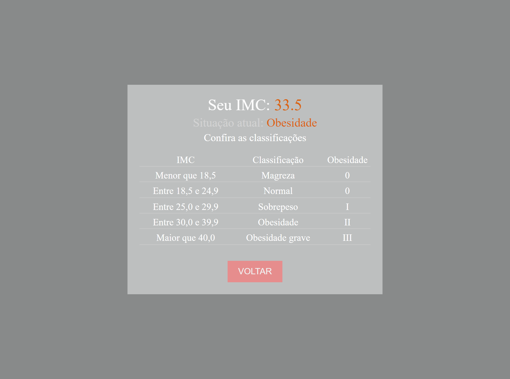
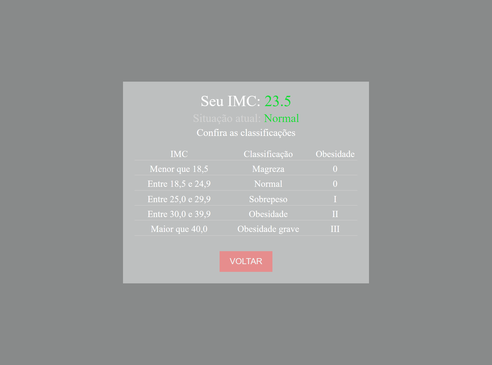

# **Calculadora de IMC.** <h1>

Deseja conferir como ficou o resultado do projeto? Teste a funcionalidade através deste Link: [Clique Aqui]( https://jorgedeaquino.github.io/calculadora-de-IMC/?altura=&peso=).

## **Demonstração Desktop**
  
  

## **Sobre o Projeto** <h2>
  
Como funcionalidades, possibilita inserir os dados para realização do cálculo para estimar o IMC (Índice de Massa Corpórea), com função de limpar o formulário, transição de telas e botão para retorno da primeira tela para realizar novo cálculo.
Na tela de resultado apresenta tabela para informar valores de índices além do feedback visual de acordo com o índice calculado:
	* Magreza = informe amarelo
	* Normal = informe verde
	* Sobrepeso = informe amarelo
	* Obesidade = informe vermelho
	* Obesidade Grave = informe vermelho mais intenso

  
## **Tecnologias Utilizadas** <h2>

* JavaScript 
  
* HTML 
  
* CSS 

  
  
  
Contato: [Linkedin]( https://www.linkedin.com/in/jorge-alexandre-de-aquino/)

## **Considerações** <h2>

* Ajuste de cores.

* Adição de responsividade para mobile.
