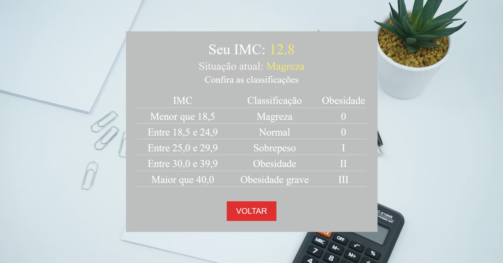
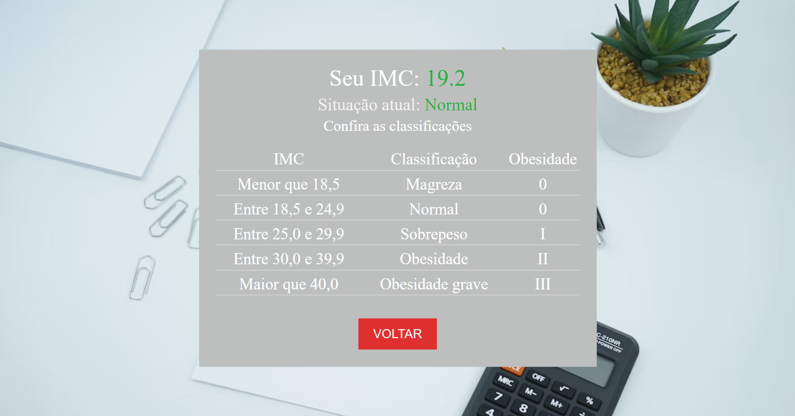
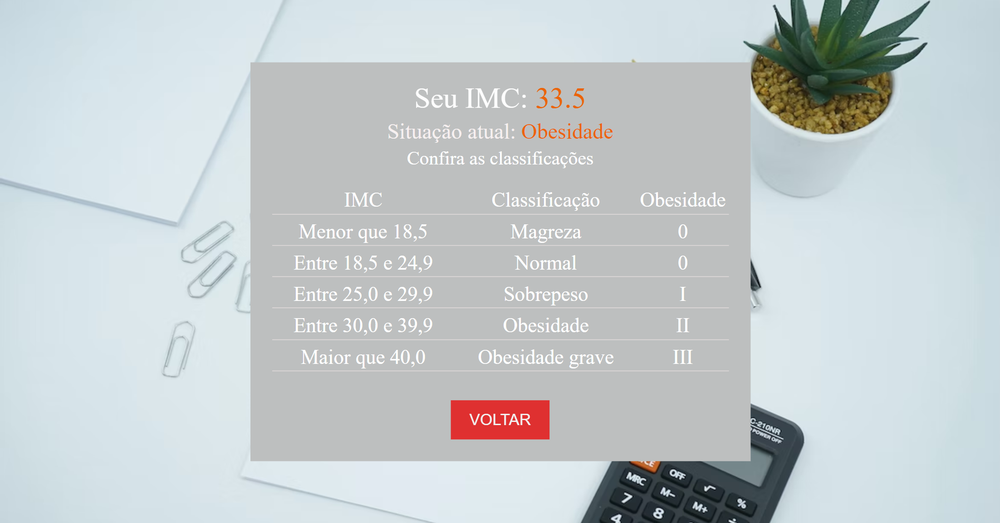
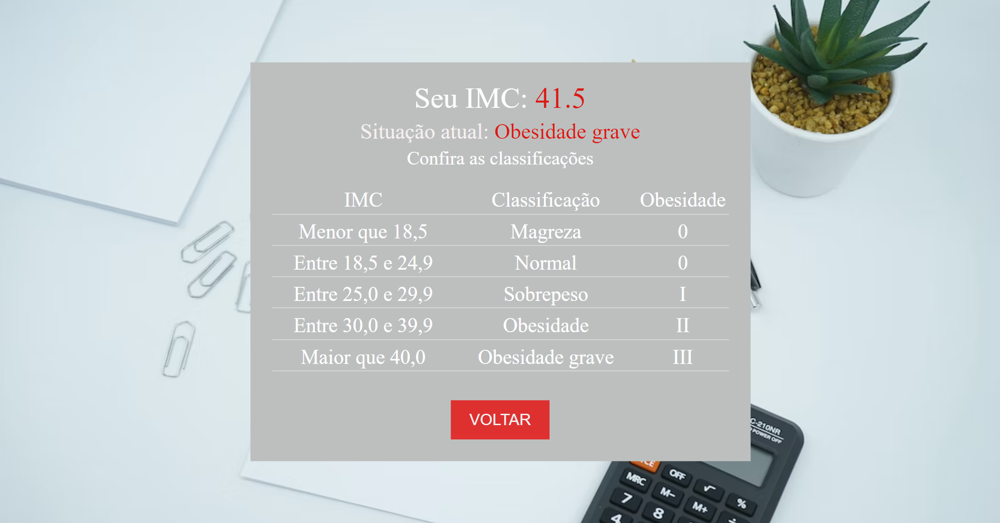

<h1>Calculadora de IMC 🥗🤞🍅</h1>

Deseja conferir como ficou o resultado do projeto? Teste a funcionalidade através deste Link: [Clique Aqui]( https://jorgedeaquino.github.io/calculadora-de-IMC/?altura=&peso=).

## **Demonstração Desktop**

 
 

 

<h2>Sobre o Projeto:</h2>
  
Como funcionalidades, possibilita inserir os dados para realização do cálculo para estimar o IMC (Índice de Massa Corpórea), com função de limpar o formulário, transição de telas e botão para retorno da primeira tela para realizar novo cálculo.
Na tela de resultado apresenta tabela para informar valores de índices além do feedback visual de acordo com o índice calculado:
	* Magreza = informe amarelo
	* Normal = informe verde
	* Sobrepeso = informe amarelo
	* Obesidade = informe vermelho
	* Obesidade Grave = informe vermelho mais intenso

<h2>Tecnologias utilizadas:</h2>

        
        JavaScript

	
  
	

        
        HTML

	
  
	

        
        CSS

	
  
	

        
        Git

  
  
  

 
  <h2> Contatos:</h2>
   
  

## **Considerações** <h2>

* Adição de responsividade para mobile.
